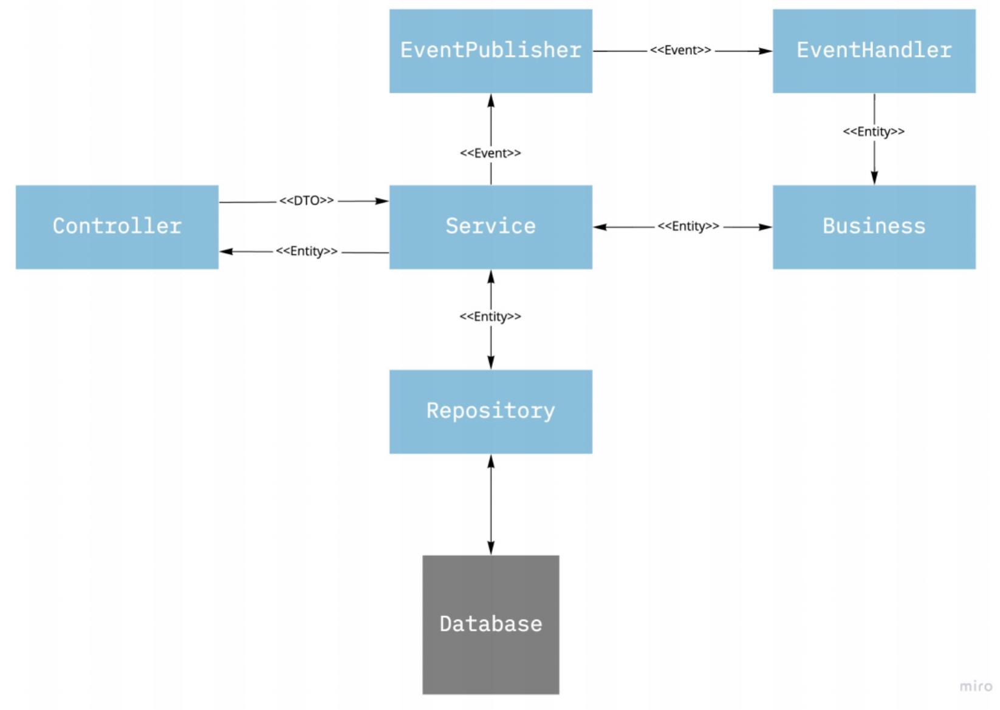

# CO2 Monitoring API

Restful API to collect data from sensors to monitoring CO2 concentrations and create alerts when it reaches critical levels.

## Endpoints

### Register CO2 concentration for a given sensor

- POST at /api/v1/sensors/{sensorId}/mesurements

Payload:

```json
{
  "co2" : 150,
  "time" : "2020-06-22T18:55:47+00:00"
}
```

Response:

- HTTP status 200 with empty body for sucessfully operation.

### Get sensor status

- GET at /api/v1/sensors/{sensorId} 

Response:

- HTTP 200

```json
{
  "status" : "OK"
}
```

- HTTP Status 404 - If no sensor was found for the given `sensorId`.

### Get sensor metrics for the last 30 days.

- GET at /api/v1/sensors/{sensorId}/metrics

Response:

- HTTP Status 200

```json
{
  "maxLast30Days" : 1200,
  "avgLast30Days" : 900
}
```

### Listing the alerts for a given sensor

- GET at /api/v1/sensors/{uuid}/alerts

Response:

- HTTP Status 200

```json
[
  {
    "startTime" : "2019-02-02T18:55:47+00:00",
    "endTime" : "2019-02-02T20:00:47+00:00",
    "mesurement1" : 2100,
    "mesurement2" : 2200,
    "mesurement3" : 2100,
  }
]
```

# Architecture

This project was created using the Spring boot framework and following the most used conventions for a Spring boot project by separating the technical details into separated layers (layered architecture). The communication between layers is made using DTO and domain entities.

The clean architecture based approach was used in this project to isolated business logic from the technology framework (framework agnostic).

Layers:

- **Controllers** - Provider HTTP Restful endpoints.
- **Services** - Provider business logic orchestration. 
- **Repository** - Provider the persistence layer.
- **EventHandlers** - Handling asynchronous operations.

The following diagram shows the communication between each layer.



## Project organization

To demonstrate the architecture project into the project organization, I tried to let the layers as clear as possible in the project structure, each package has an important representation in the organization:

```yaml
│  README.md
│  build.gradle
│  settings.gradle
└─ src
|  └─ business
|  └─ controller
|  └─ domain
|  |  └─ entity
|  |  └─ repository
|  |  └─ vo
|  └─ dto
|  └─ event
|  └─ exception
|  └─ service 
|  └─ configuration 
└─ tests
   └─ business
   └─ service
   └─ controller
```

## Packages responsability

#### - business

This package contains all business rules. All business rules must be written in a pure function approach, that meaning no side effect is allowed in this layer. 

The main reason to keep business rules as a pure function is to write easier unit testing for all business logic of the project and keep them independent of the technical details.

The service package is the only layer able to access this business package.

#### - service

This layer is responsible to orchestrate the operation across all business rules required to complete a specific use case of the application. 

Are responsible for this layer:

- Manage transactions
- Dependency Injection
- Business rules orchestration
- Publish Events

#### - controller

This layer is responsible to provide HTTP Restful endpoints and converting JSON inputs into object as well as the output into API specifications.

#### - entity

- Entities epresinting the state of a specific resource of the application. 
- Entities should be immutable to keep data consistent. 
- Entities must be create or updated in the business layer.

#### - repository

The repository is an interface that should be used to fetch or persist an entity on databases. A simple database in-memory was implemented to avoid taking care of a complex persistent layer due to the focus was to solve the business problem.

#### - vo 

This package contains the Value Object of the application. A Value Object is an immutable type that is distinguishable only by the state of its properties.

- [VO Reference](https://deviq.com/value-object/)

#### - dto

Data transfer objects are lightwave objects to communicate between the controller and the service layer.

#### - event

Classes that represent a fact that occurs in the application. An event must be an immutable object.

#### - exception

Custom excpetion should be defined here.

#### - configuration

Spring boot configuration classes should be defined here.

# Tests

Each commit will be tested using Github's actions.

### business

As business rules are pure functions, mocks are not allowed here, so just individual and focused tests are necessary for each test any business function.

### services

Testing the integration between the service, and their dependencies with business rules.

- Mocks are allowed to simulate the integration with dependencies resources, such respositories, event-bus, etc.

### controller

This is an integration test to guarantee the API works as defined in the contract.

# Install & running

## Pre requisites

Make sure you have all the following requisites before run:

- Java 14 or later

# How to build

```sh
./gradlew compileJava
```

# How to test

```sh
./gradlew test
```

# How to running

```sh
./gradlew bootRun
```

## Docker

TBD
